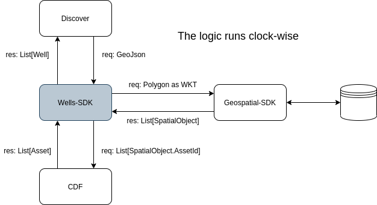

<a href="https://cognite.com/">
    
</a>

# Cognite Wells JS SDK (derived from stable)

The purpose of the wells-sdk is to build a layer on top of the core CDF API that allows for interpreting and querying data in the context of the Cognite well model / wells data layer. The well model / wells data layer is a representation of how well data can be described and modeled in terms of Cognite’s reusable resources (assets, sequences, geospatial, etc).

The importance of such a representation is being able to concatenate data from different sources into a single contextualized representation that is independent of source and customer. This allows both apps, such as Discover, and also geoscientists running models on top of well data, to be able to find the data they need and use it without having to consider where this data came from and what is its original format.

This package provides an SDK derived from `@cognite/sdk`, aka
[stable](https://github.com/cognitedata/cognite-sdk-js/blob/master/packages/stable/README.md).

It is recomended to install this package under the same name as `@cognite/sdk`.
This allows you to change SDK versions without changing your imports.
See the [beta readme](https://github.com/cognitedata/cognite-sdk-js/blob/master/packages/beta/README.md) for details.

### install and build

```bash
yarn install
yarn build
```

### consuming

##### set your env variables (must be valid for both cdf and geospatial API)

```bash
COGNITE_WELLS_PROJECT=<project-tenant>
COGNITE_WELLS_CREDENTIALS=<your-api-key>
```

#### setup client

```bash
const { CogniteClient } = require("@cognite/sdk-wells");

let client = new CogniteClient({
  appId: `JS SDK test (${name})`,
  baseUrl: "https://api.cognitedata.com",
});

client.loginWithApiKey({
  project: process.env.COGNITE_WELLS_PROJECT,
  apiKey: process.env.COGNITE_WELLS_CREDENTIALS,
});
```

#### run a polygon query by GeoJson

```bash
const polygon = {
    type: 'Polygon',
    coordinates: [
    [
        [-4.86423, 63.59999],
        [19.86423, 63.59999],
        [19.86423, 52.59999],
        [-4.86423, 52.59999],
        [-4.86423, 63.59999],
    ],
    ],
};

const response = await client.wells.searchByPolygon({geometry: polygon});
```

#### run a polygon query by wkt

```bash
const polygon = 'POLYGON ((-4.86423 63.59999, 19.86423 63.59999, 19.86423 52.59999, -4.86423 52.59999, -4.86423 63.59999))';

const response = await client.wells.searchByPolygon({geometry: polygon});
```

#### run a polygon query by wkt

```bash
const polygon = 'POLYGON ((-4.86423 63.59999, 19.86423 63.59999, 19.86423 52.59999, -4.86423 52.59999, -4.86423 63.59999))';

const response = await client.wells.getWellsByPolygon({geometry: polygon});
```



### Testing the wells package only

This repo contains some integration tests that require a CDF api key for `subsurface-test` tenant.
Talk to any of the contributors or leave an issue and it'll get sorted.
Travis will run the test and has its own api key.

Run all tests:

navigate to wells package root directory:

```bash
cd /cognite-sdk-js/packages/wells
```

```bash
yarn build
COGNITE_WELLS_PROJECT=<project-tenant> COGNITE_WELLS_CREDENTIALS=<your-api-key> yarn test
```
