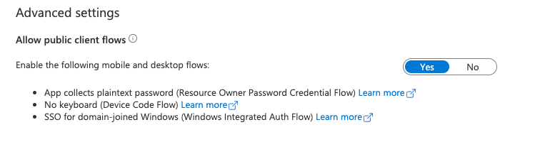

# Device code grant flow

This is the flow used for [Device Authorization Grant](https://oauth.net/2/grant-types/device-code/)

## Prerequisite

Make sure you have read the [prerequisite-guide](../../README.md#prerequisite) before continuing.

Your application registration needs `Allow public client flows` enabled for this flow to work.




## Install

Go to this folder in your terminal and run:

`npm install`

or with yarn:

`yarn`

## Run

`AZURE_TENANT_ID=... COGNITE_PROJECT=... CLIENT_ID=... node build/device_grant.ts`

## How to get logged by yourself?

1. Add the Cognite SDK, open and @azure/msal-node to your project with yarn or npm.

```sh
yarn add @cognite/sdk@6.1.1
yarn add @azure/msal-node
yarn add open
```

```sh
npm install @cognite/sdk@6.1.1
npm install @azure/msal-node
npm install open
```

2. Create a new file called `device_grant.ts` and import all necessary things.

```sh
import { CogniteClient } from '@cognite/sdk';
import { PublicClientApplication } from '@azure/msal-node';
import open from 'open';
```

3. Instantiate three consts with your project name, clientID, and your tenantID.

```sh
const project: string = process.env.COGNITE_PROJECT!;
const clientId: string = process.env.CLIENT_ID!;
const azureTenant = process.env.AZURE_TENANT_ID!;
```

4. Create a function called `deviceCodeGrantExample` with the following code:

```ts
async function deviceCodeGrantExample() {
  const pca = new PublicClientApplication({
    auth: {
      clientId,
      authority: `https://login.microsoftonline.com/${azureTenant}`,
    },
  });

  const client = new CogniteClient({
    appId: 'Cognite SDK samples',
    project,
    baseUrl: 'https://api.cognitedata.com',
    oidcTokenProvider: () =>
      pca
        .acquireTokenByDeviceCode({
          deviceCodeCallback: ({ message, userCode, verificationUri }) => {
            open(verificationUri)
              .then(() => console.log(`Enter ${userCode}`))
              .catch(() => console.log(message));
          },
          scopes: ['https://api.cognitedata.com/.default'],
        })
        .then((response) => response?.accessToken!),
  });

  await client.authenticate();

  const info = (await client.get('/api/v1/token/inspect')).data;

  console.log('tokenInfo', JSON.stringify(info, null, 2));

  try {
    const assets = await client.assets.list();
    console.log(assets);
  } catch (e) {
    console.log('asset error');
    console.log(e);
  }
}
```

5. Call the `deviceCodeGrantExample` function.

```ts
deviceCodeGrantExample()
  .then(() => { process.exit(0); })
  .catch((err) => { console.error(err); process.exit(1); });
```

6. Build your project.

`npm run tsc`

or with yarn

`yarn tsc`

7. Finally, run your code with:

```sh
AZURE_TENANT_ID=... COGNITE_PROJECT=... CLIENT_ID=... node build/device_grant.ts
```
